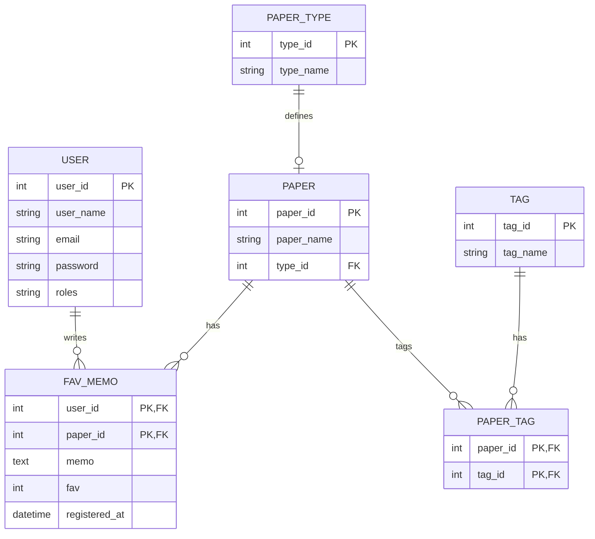

## アプリケーション概要
近年、同人誌やZINEなど、少部数の本・冊子などを個人でつくりやすい環境が整ってきています。
しかしいざ印刷所に注文する際、さまざまな種類の紙があってどれを選べばいいのか悩ませます。
Fav Paperは、本づくり初心者のための印刷用紙辞典です。

専門家による紙の特徴説明を読んだり、紙の用途（カバー・表紙・本文など）、手触り、特徴などで検索したりして、
評価やメモをつけてストックすることができます。
また、セット登録機能は、気になった本で使われている紙の一式や、自分で使った紙の一式を記録するのに便利です。

Fav Paperは、本づくりに便利な、紙選びが楽しくなるWebアプリケーションです。

## ER図

### URL一覧

| 画面                | URL               | 備考                        |
|---------------------|-------------------|-----------------------------|
| ログイン            | /login            |                             |
| ログアウト          | /logout           |                             |
| トップ              | /                 |                             |
| 紙の一覧            | /paper/list       |                             |
| 紙の検索・登録      | /paper            | adminのみ登録可能           |
| 紙の削除            | /paper/edit       | adminのみ                   |
| タグの一覧          | /tag/list         |                             |
| タグの登録          | /tag              |                             |
| ペーパータグの一覧  | /paper_tag        |                             |
| お気に入り          | /fav_memo         |                             |
| お気に入り編集画面  | /fav_memo/edit    |                             |
| 全ユーザーのお気に入り一覧 | /fav_memo/list | adminのみ                   |
| ユーザー登録        | /user             |                             |
| ユーザー一覧        | /user/list        | adminのみ                   |

## できること
### 紙の一覧表示・検索（ログインせずに可能）
アプリケーションに登録してある紙から、名前・種類・特徴（タグ）などで検索します。

▼紙の一覧表示

▼紙のタグから表示

ひとつの紙にひとつの種類（paper_typeテーブル）・複数のタグ（tagテーブル）が紐づいています。
タグは中間テーブルpaper_tagで管理しています

紙の例：アラベール、NTラシャ、A-プラン、グムンドコットン　など
種類の例：高級印刷用紙、一般印刷用紙、ファンシーペーパー　など
タグの例：ふわふわ、すべすべ、オフセット印刷適正、色数が多い、海外製　など

### 紙のお気に入り登録（ログイン後、可能）
お気に入り登録した紙に、お気に入り度（1〜5）、メモを追加できます。

### 全ユーザーのお気に入り一覧表示（管理者のみ）

### お気に入りに登録された紙のランキング表示　※未実装

### お気に入りに対して提案　※未実装
お気に入りに登録した紙に対してアプリケーション側からおすすめの紙が提案されます

### ユーザーの一覧表示（管理者のみ）

