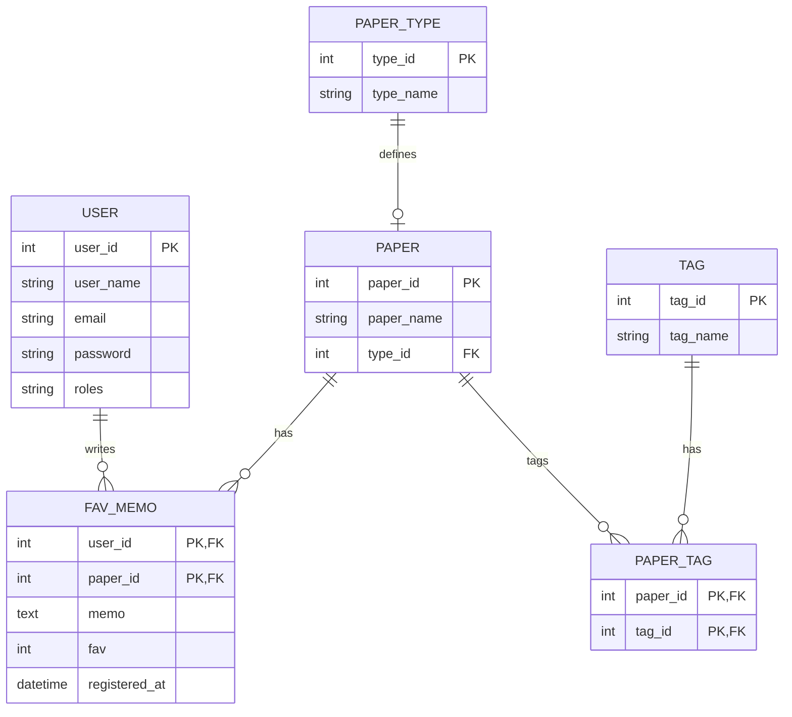

## アプリケーション概要
「Fav Paper」は、本づくり初心者が文学作品・ZINE・同人誌などをつくるときに便利な、最適な紙選びを助けるアプリケーションです。  

出版・印刷業界は不況といわれる一方で、個人がつくる少部数の本や冊子が人気です。  
↓参考：日本経済新聞「今こそ紙、文学フリマ燃ゆ　出版不況なのに8都市4万人」  
https://www.nikkei.com/article/DGXZQOUC20DNL0Q4A221C2000000/

そんな本の作り手たちが、データベースからより最適な紙を見つけたり、紙の情報を手元に集めておくことができます。  
Fav Paperは、紙選びが楽しくなる、本づくりに便利なWebアプリケーションです。

【紙の情報検索】紙の用途（カバー・表紙・本文など）、手触り、特徴などで検索、専門家による紙の特徴説明を読むことができます。  
【お気に入り】紙に自分の評価やメモをつけてストックすることができます。  
【セット登録（未実装）】気になった本で使われている紙の一式や、自作の本に使った紙の一式を記録できます。  

## 使用言語

### フロントエンド
HTML / CSS / JavaScript

### バックエンド
Java / MySQL

### フレームワーク
Spring Boot

## ER図

### URL一覧

| 画面                | URL               | 備考                        |
|---------------------|-------------------|-----------------------------|
| ログイン            | /login            |                             |
| ログアウト          | /logout           |                             |
| トップ              | /                 |                             |
| 紙の一覧・検索            | /paper/list       |                             |
| 紙の登録      | /paper            | adminのみ           |
| 紙の削除            | /paper/edit       | adminのみ                   |
| タグの一覧          | /tag/list         |                             |
| タグの登録          | /tag              |                             |
| ペーパータグの一覧  | /paper_tag        |                             |
| お気に入り          | /fav_memo         |                             |
| お気に入り編集画面  | /fav_memo/edit    |                             |
| 全ユーザーのお気に入り一覧 | /fav_memo/list | adminのみ                   |
| ユーザー登録        | /user             |                             |
| ユーザー一覧        | /user/list        | adminのみ                   |

## できること
### 紙の一覧表示・検索

▼ログイン→紙の一覧表示→お気に入りの表示→紙の検索→ログアウト

### 紙のお気に入りに追加・削除

## 今後の実装予定
・お気に入り登録時に、お気に入り度（1〜5）、メモを追加

・検索結果の表示順変更

・お気に入りの中から検索

・ユーザー編集、新規ユーザー登録画面

・管理者画面（紙、種類、タグ、ユーザー、お気に入りの編集）

・お気に入りに対して似ている紙を提案

・本文・カバーなど一式で記録できる機能
